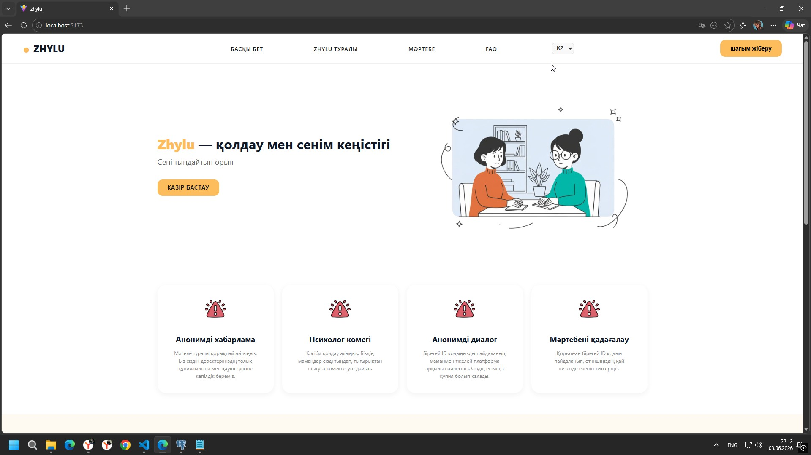
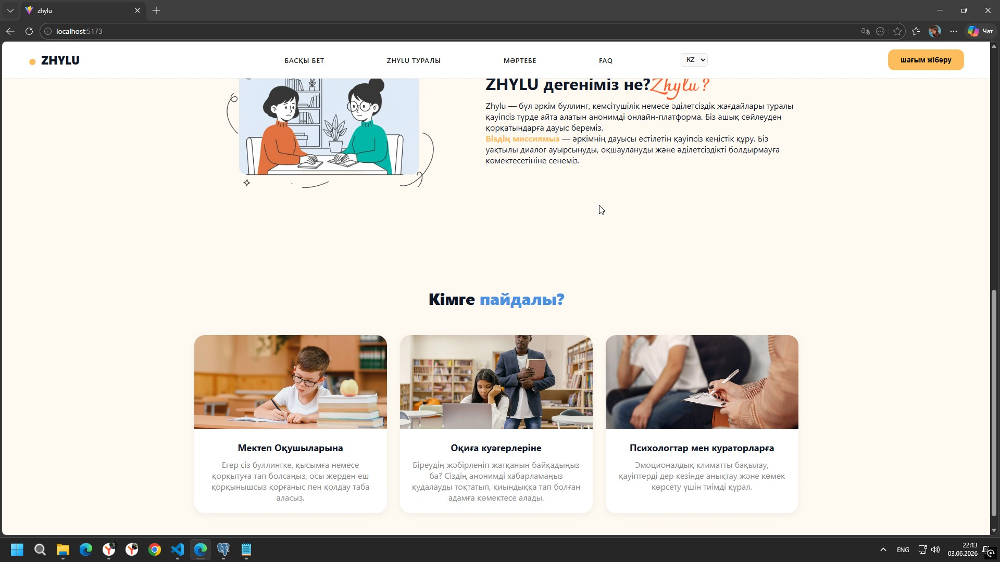
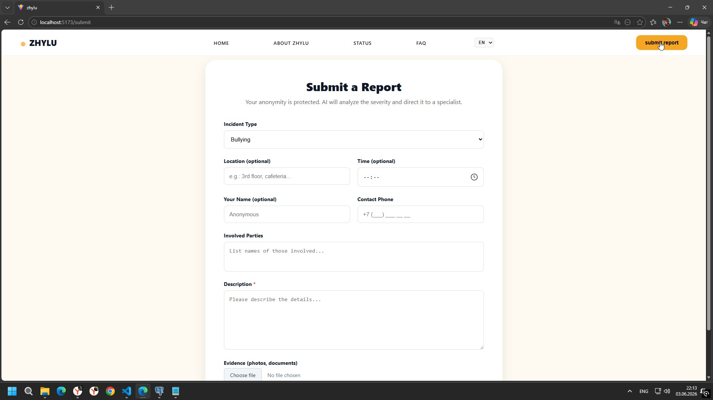
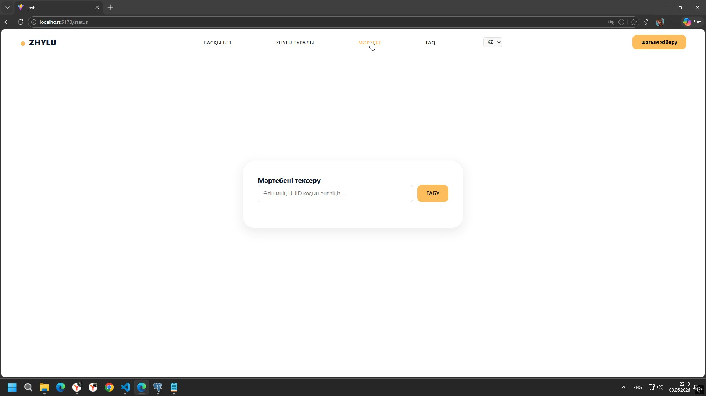
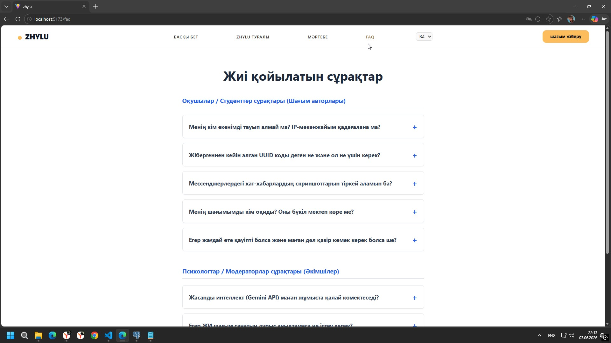
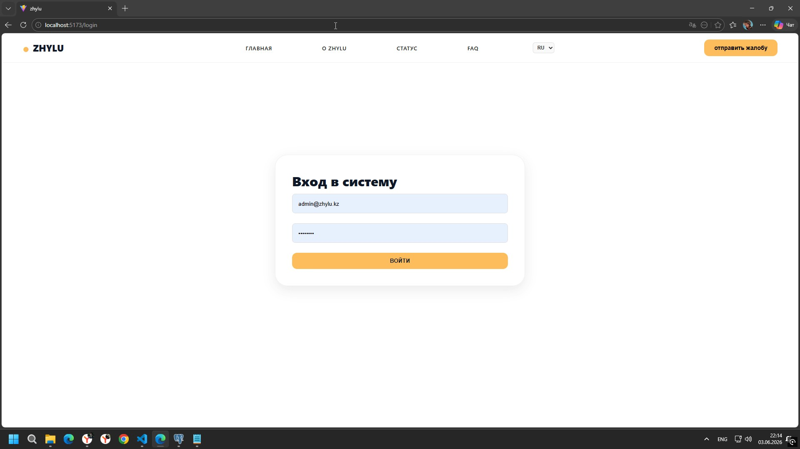
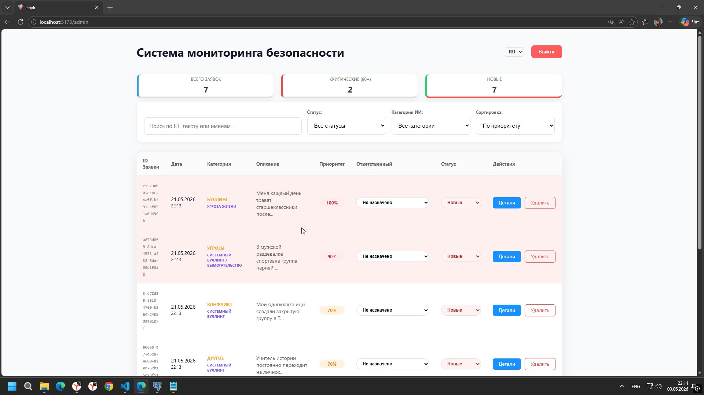
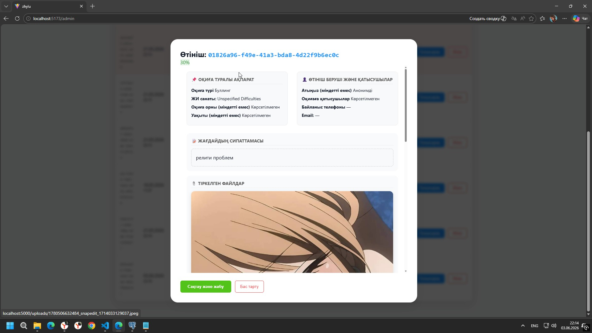
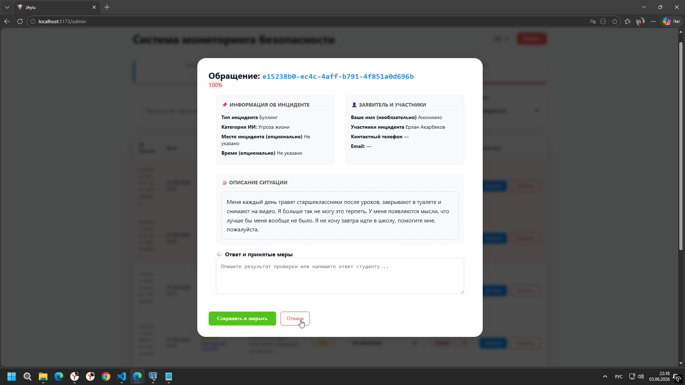

# 🛡️ Zhylu — Anonymous Anti-Bullying Platform for Schools

> **Zhylu** (каз. *"Жылу"* — тепло) — это анонимная цифровая платформа для безопасного сообщения о буллинге, кибербуллинге и психологических кризисах в школах, с автоматическим ИИ-триажем угроз в реальном времени.

---

## 📸 Скриншоты

### Главная страница
<p align="center">
  
  
</p>

### Форма жалобы и проверка статуса
<p align="center">
  
  
</p>

### FAQ
<p align="center">
  
</p>

### Панель администратора
<p align="center">
  
  
  
</p>
<p align="center">
  
</p>

---

## 📌 Описание проекта

В школах Казахстана ученики часто замалчивают случаи насилия и буллинга из-за **страха осуждения или мести**. Традиционные механизмы обращения к психологу требуют раскрытия личности, что создаёт барьер для жертв.

**Zhylu** решает эту проблему через **абсолютную анонимность**: ни регистрации, ни email, ни телефона, ни IP-адресов. Система генерирует криптографически защищённый **128-битный UUID** для отслеживания статуса обращения.

### ✨ Ключевые возможности

| Функция | Описание |
|---|---|
| 🔒 **Zero-Knowledge анонимность** | Никаких личных данных — только UUID-код для отслеживания статуса |
| 🤖 **ИИ-триаж** | Google Gemini API анализирует текст и выставляет приоритет риска (0–100%) в реальном времени |
| 🌍 **Мультиязычность** | Полная поддержка казахского 🇰🇿, русского и английского языков |
| 📎 **Медиадоказательства** | Прикрепление фото/скриншотов с клиентским сжатием через HTML5 Canvas |
| 🛂 **Панель администратора** | RBAC-система для психологов: просмотр жалоб, обновление статусов, анонимный чат |
| 💬 **Анонимный чат** | Школьник и психолог могут общаться без раскрытия личности |

---

## 🏗️ Стек технологий

### Frontend (`/zhylu`)
| Инструмент | Версия | Назначение |
|---|---|---|
| **React** | 19 | SPA-интерфейс |
| **Vite** | 7 | Сборщик, dev-сервер |
| **React Router DOM** | 7 | Клиентская маршрутизация |
| **Firebase** | 12 | Аутентификация администраторов |
| **Google Gemini API** | `@google/generative-ai` | ИИ-анализ жалоб |
| **Express.js** | 5 | Node-сервер для загрузки файлов |
| **Multer** | 2 | Обработка медиафайлов |
| **pg** | 8 | PostgreSQL-клиент для Node |
| **Nginx** | alpine | Раздача статических файлов в production |

### Backend (`/zhylu1`)
| Инструмент | Версия | Назначение |
|---|---|---|
| **Java** | 21 | Язык бэкенда |
| **Spring Boot** | 3.5.9 | REST API фреймворк |
| **Spring Data JPA** | — | ORM и работа с БД |
| **Spring Boot Actuator** | — | Мониторинг и healthcheck |
| **PostgreSQL** | 16 | Реляционная база данных |
| **Lombok** | — | Сокращение boilerplate-кода |
| **Maven** | 3.9.6 | Сборка проекта |

### Инфраструктура
| Инструмент | Назначение |
|---|---|
| **Docker** | Контейнеризация всех сервисов |
| **Docker Compose** | Оркестрация (frontend + backend + DB) |

---

## 🗂️ Структура проекта

```
zhyluMain/
├── docker-compose.yml          # Оркестрация всех сервисов
├── zhylu/                      # Frontend (React + Vite)
│   ├── src/
│   │   ├── LandingPage.jsx     # Главная страница
│   │   ├── ComplaintForm.jsx   # Форма анонимной жалобы
│   │   ├── StatusChecker.jsx   # Проверка статуса по UUID
│   │   ├── AdminPanel.jsx      # Дашборд для психологов
│   │   ├── Login.jsx           # Вход администратора (Firebase)
│   │   ├── Faq.jsx             # FAQ
│   │   └── translations.js     # i18n (KZ / RU / EN)
│   ├── server/                 # Express.js (загрузка файлов)
│   ├── Dockerfile              # Multi-stage: node → nginx
│   └── nginx.conf              # Конфиг для SPA-роутинга
└── zhylu1/
    └── zhylu1/                 # Backend (Spring Boot)
        ├── src/main/java/com/zhylu/zhylu1/
        │   ├── controller/     # REST-контроллеры
        │   ├── entity/         # JPA-сущности (Complaint, User)
        │   ├── repository/     # Spring Data репозитории
        │   └── config/         # WebConfig (CORS и др.)
        ├── my-database-structure.sql  # Схема БД
        ├── Dockerfile          # Multi-stage: maven → jre
        └── pom.xml
```

---

## 🚀 Как запустить (How to Run)

### Способ 1: Docker (рекомендуется) ⭐

**Требования:** [Docker Desktop](https://www.docker.com/products/docker-desktop/) (включает Docker Compose)

```bash
# 1. Клонируй репозиторий
git clone https://github.com/<your-username>/zhylu.git
cd zhylu

# 2. Создай файл с переменными окружения для фронтенда
cp zhylu/.env.example zhylu/.env
# Открой zhylu/.env и вставь свои ключи (см. раздел ниже)

# 3. Запусти все сервисы одной командой
docker compose up --build

# 4. Открой в браузере:
#    Приложение:   http://localhost
#    Backend API:  http://localhost:5000
```

> Чтобы остановить: `docker compose down`  
> Чтобы также удалить данные БД: `docker compose down -v`

---

### Способ 2: Локальный запуск (без Docker)

#### Требования
- [Node.js](https://nodejs.org/) v20+
- [Java JDK 21](https://adoptium.net/)
- [Maven 3.9+](https://maven.apache.org/)
- [PostgreSQL 16](https://www.postgresql.org/)

#### 1. База данных

```sql
-- В psql или pgAdmin создай БД и примени схему:
CREATE DATABASE postgres;
\c postgres
\i zhylu1/zhylu1/my-database-structure.sql
```

#### 2. Backend (Spring Boot)

```bash
cd zhylu1/zhylu1

# Создай/отредактируй src/main/resources/application.properties:
# spring.datasource.url=jdbc:postgresql://localhost:5432/postgres
# spring.datasource.username=<твой_пользователь>
# spring.datasource.password=<твой_пароль>

# Запуск
./mvnw spring-boot:run
# Backend будет доступен на http://localhost:5000
```

#### 3. Frontend (React)

```bash
cd zhylu

# Создай .env файл (см. раздел "Переменные окружения")
npm install
npm run dev
# Приложение будет доступно на http://localhost:5173
```

---

## 🔑 Переменные окружения

Создай файл `zhylu/.env` на основе этого шаблона:

```env
# Google Gemini API (для ИИ-анализа жалоб)
# Получить: https://aistudio.google.com/app/apikey
VITE_GEMINI_API_KEY=your_gemini_api_key_here

# Firebase (для аутентификации администраторов)
# Получить: https://console.firebase.google.com/
VITE_FIREBASE_API_KEY=your_firebase_api_key
VITE_FIREBASE_AUTH_DOMAIN=your_project.firebaseapp.com
VITE_FIREBASE_PROJECT_ID=your_project_id
VITE_FIREBASE_STORAGE_BUCKET=your_project.appspot.com
VITE_FIREBASE_MESSAGING_SENDER_ID=your_sender_id
VITE_FIREBASE_APP_ID=your_app_id
```

> ⚠️ **Никогда не коммить `.env` файл в репозиторий!** Убедись, что `.env` есть в `.gitignore`.

---

## 🎯 Зачем это нужно?

В открытом доступе **не существует** публичных датасетов и платформ для мониторинга буллинга на **казахском языке** с поддержкой местного сленга. Zhylu — первая попытка создать инструмент, адаптированный именно для школ Казахстана, с учётом культурного контекста и языковых особенностей региона.

---

## 📄 Лицензия

MIT License — используй свободно, с указанием авторства.
